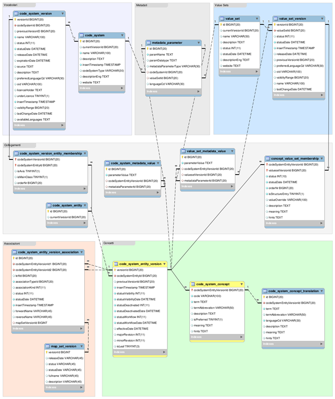
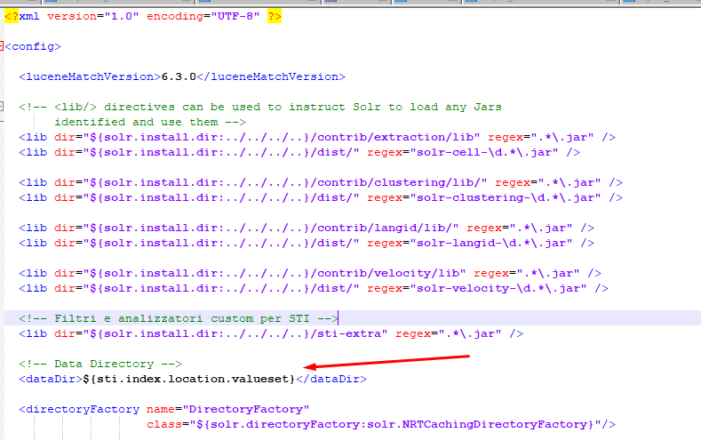
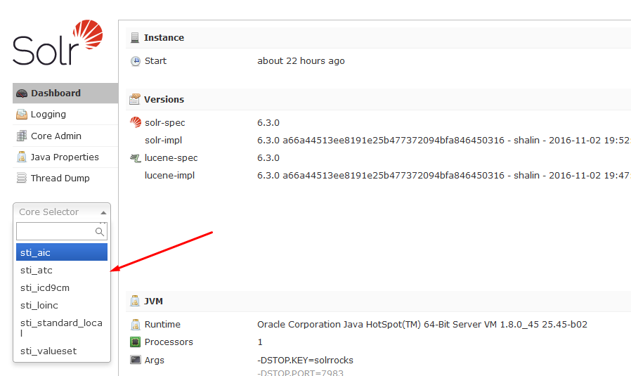
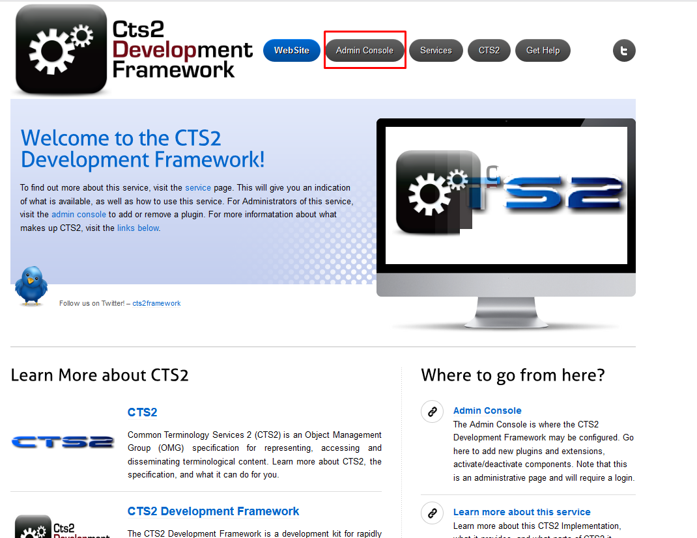
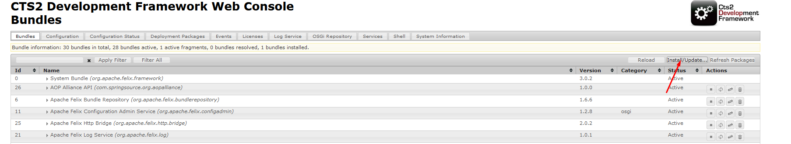
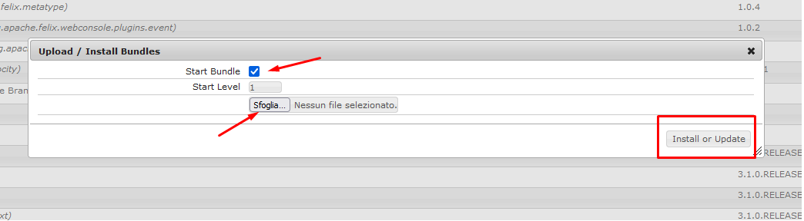

# Servizio Terminologico Integrato (plugin per CTS2 Framework) 
### Nome del modulo:  sti-service

## Modulo maven contenente il codice di integrazione con il framework cts2


### Descrizione

Il progetto rappresenta un plugin (OSGI) installabile nel framework CTS2 attraverso la sua console web. Il modulo implementa degli 'hook' per il framework CTS2.


### Descrizione Repository
Questo repository contiene il modulo parent sti-cts2-portlets-build e i seguenti moduli figli
- sti-service[plugin (bundle osgi) per la gestione/importazione delle codifiche]

  


## Prerequisiti
Prima di procedere al download dei sorgenti per il corretto funzionamento occorre installare le seguenti.
Per l'installazione degli applicativi si demanda alla documentazione ufficiale

- SO AlmaLinuxOS [https://almalinux.org/it/]

- JDK 1.8 [https://www.oracle.com/it/java/technologies/javase/javase8-archive-downloads.html]

- Maven 3.6.3 [https://maven.apache.org/docs/3.6.3/release-notes.html] 

- Postgres 9.6 [https://www.postgresql.org/ftp/source/]

- solr-6.3.0 [https://archive.apache.org/dist/lucene/solr/]

- sti-cts2-framework-1.2.0.FINAL [https://github.com/iit-rende/sti-cts2-framework] 

  

## Installazione 
Per procedere alla corretta installazione dei moduli del presente repository è necessario scaricare e configurare prima i repository [**sti-cts2-framework-1.2.0.FINAL** e **sti-service**] ed è importante che i moduli stiano nella stessa directory in quanto il presente modulo dipende dal framework.

Di seguito la dipendenza nel pom.xml del modulo **sti-service**

​	<parent>
​		<groupId>edu.mayo.cts2.framework</groupId>
​		<artifactId>cts2-base-service-plugin</artifactId>
​		<version>1.2.0.FINAL</version>
​		<relativePath>../cts2-framework-1.2.0.FINAL/cts2-base-service-plugin/pom.xml</relativePath>
​	</parent>


Per l'installazione degli applicativi [AlmaLinuxOS, JDK 1.8, Postgres 9.6, liferay-portal-6.2-ce-ga6,solr-6.3.0] si rimanda alla documentazione ufficiale.
Per quanto riguarda [framework cts2] l'installazione è descritta nei repository di riferimento.


## Configurazione Ambiente

Per il corretto funzionamento del modulo è necessario creare i DB e avviare solr. Nel progetto è presente una folder **".../sti-service/extra"**

#### DB

Schema DB




Dalla URL **..TODO_URL_DOWNLOAD\database\DB-DATI-BASE **, sono presenti gli script per la generazione dei 2 schema e il popolamento dei dati relativi alle codifiche di base (**LOINC; ATC; AIC; ICD9-CM**) gestite dal sistema. 

Con i seguenti comandi importiamo gli script nel DB postgres.


```shell
psql sti_service < sti_service.sql
psql sti_import < sti_import.sql
```


#### Solr

Dopo aver scaricato solr bisogna aggiungere gli indici per gestire le codifiche. Nella folder **"..\sti-service\extra\solr\solr_conf\"** sono presenti definizioni degl'indici, quindi per ogni codifica sono definiti i file "schema.xml" e  "solrconfig.xml". 

Le definizioni degli indici vanno copiate dentro solr (in servizio non deve esser attivo) sotto la folder **"PATH_SOLR/Solr-6.3.0/server/solr\"**, successivamente vanno settate le prop e poi va avviato il servizio.


Successivamente bisogna editare il file "**solr-6.3.0/bin/solr.in.sh**" definendo le proprietà "sti.index.location.**NOME_INDICE**" utilizzate nei file ../solrconfig.xml dei rispettivi indici per indicare la folder di destinazione dei dati. Di seguito un esempio di configurazione


SOLR_OPTS="$SOLR_OPTS -Dsti.index.location.loinc=/PATH/INDICI_SOLR/SOLR_IDX/LOINC_IDX"

SOLR_OPTS="$SOLR_OPTS -Dsti.index.location.icd9cm=/PATH/INDICI_SOLR/SOLR_IDX/ICD9CM_IDX"

SOLR_OPTS="$SOLR_OPTS -Dsti.index.location.atc=/PATH/INDICI_SOLR/SOLR_IDX/ATC_IDX"

SOLR_OPTS="$SOLR_OPTS -Dsti.index.location.aic=/PATH/INDICI_SOLR/SOLR_IDX/AIC_IDX"

SOLR_OPTS="$SOLR_OPTS -Dsti.index.location.standard_local=/PATH/INDICI_SOLR/SOLR_IDX/STANDARD_LOCAL_IDX"

SOLR_OPTS="$SOLR_OPTS -Dsti.index.location.valueset=/PATH/INDICI_SOLR/SOLR_IDX/VALUESET_IDX"

SOLR_OPTS="$SOLR_OPTS -Ddisable.configEdit=true"


Di seguito un esempio di come vengono usate le prop precedentemente definite. I codice fa riferimento alla definizione dell'idice per i valueset presente sotto **..\sti-service\extra\solr\solr_conf\sti_valueset_conf\solrconfig.xml**





Dalla URL **..TODO_URL_DOWNLOAD\solr\INDICI-SOLR-DATI-BASE\SOLR_IDX"** è presente un dump degli indici contenente i dati delle codifiche di base (**LOINC; ATC; AIC; ICD9-CM**) relativo al dump del DB **..TODO_URL_DOWNLOAD\database\DB-DATI-BASE**. Quindi i caso di caricamento del DB con i dati di base bisogna prendere anche gli indici SOLR contenenti i dati in modo che all'avvio dell'applicazione sia tutto correttamente funzionante.

Il download del DB e degli indici SOLR aggiornati con tutte le codifiche è disponibile alle seguenti URL


**..TODO_URL_DOWNLOAD\solr\INDICI-SOLR-FULL\SOLR_IDX**

**..TODO_URL_DOWNLOAD\database\DB-FULL**


ora si può avviare SOLR

```
/PATH_SOLR/solr-6.3.0/bin/solr stop
/PATH_SOLR/solr-6.3.0/bin/solr start
```


Se tutto è andato bene dovremo accedere alla console di solr all'indirizzo (http://HOST:8983/solr/) e verificare che gli indici siano presenti.




## Build
Per la build del modulo è necessario scaricare e installare - Maven 3.6.3 [https://maven.apache.org/docs/3.6.3/release-notes.html] o superiore

A questo punto si considera un ambiente configurato e con il framework cts2 correttamente importato come dipendenza e deployato sotto Liferay come descritto nel repository  [https://github.com/iit-rende/sti-cts2-framework] 
Per la build  comandi da dare sono i seguenti (scaricare i sorgenti, entrare nella folder del progetto e lanciare il comando maven per generale la build)

```sh
git clone https://...
cd sti-service
mvn clean install
```


## Deploy

Una volta buildato i modulo verrà prodotto un jar da caricare nella console web di cts2.

Se l'ambiente è correttamente configurato e il framework cts2 è deployato sotto Liferay si potrà accedere alla console alla seguente url

http://HOST/cts2framework/ cliccando su Admin Console, caricando il file precedentemente buildato e  confermando il caricamento.

N.B. in caso di conferma spuntare "Start Bundle"


Accesso alla console




Caricamento plugin




Conferma




Per ulteriori approfondimenti si rimanda alla documentazione di cts2 framework


## Copyright ©
 [TODO]

## Maintainer
 [TODO]


## License 
 [TODO]
**http://www.apache.org/licenses/LICENSE-2.0**